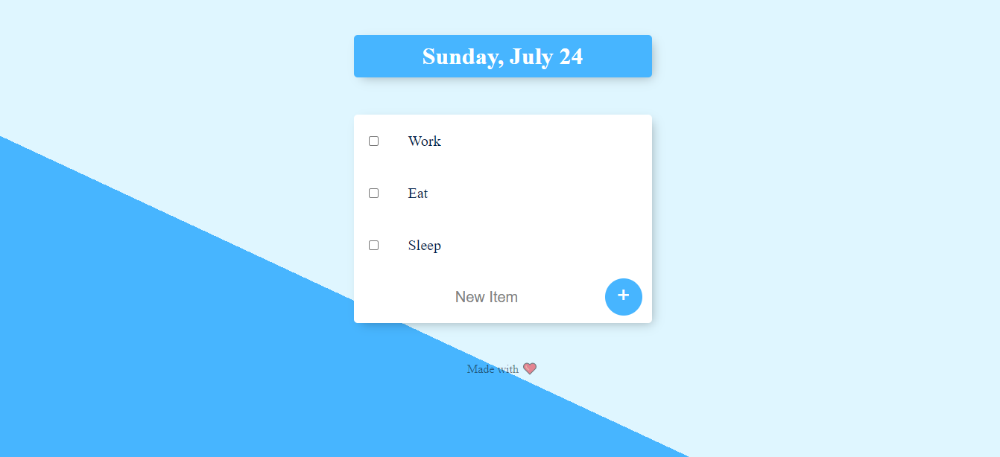

# Todo List

```Todo List``` is a simple Node.js web application with MongoDB database. List items can be added and deleted dynamically and custom list can also be created.<br>


<br>

### Structure

1. ```app.js``` is the starting point for the website, configures the server and content. 

2. ```todoListDB``` is the database name. 

### Environment variable

```PASSWORD``` You need to enter your MongoDB Atlas user password to connect to database.


## Getting Started

### Installation

1. To install all dependencies in the package.json
   ```npm install```

2. Connect to your MongoDB Atlas database server

2. To run the application
   ```npm start```

3. Open http://localhost:3000/ check and confirm